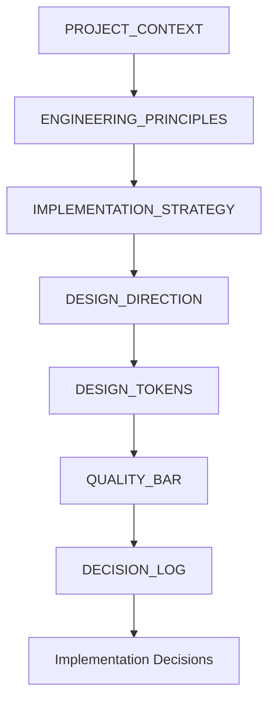
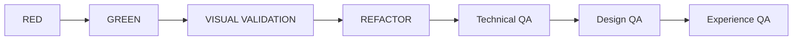
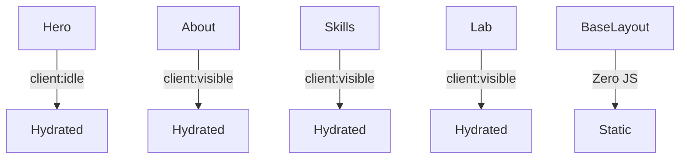

# Henrique Portfolio — Engenharia Editorial, Performance e Governança Frontend

https://bytebytego.com/ Um estudo sobre como construir produtos digitais premium sem sacrificar clareza, performance, simplicidade e percepção de qualidade.

---

# Visão Geral

A maioria dos portfolios frontend modernos sofre do mesmo problema: excesso. Excesso de abstrações, motion, hidratação, componentes, grids, tecnologia — e pouca intencionalidade.

Este projeto nasceu da tentativa de responder uma pergunta muito mais difícil:

> Como construir uma experiência frontend que transmita profundidade técnica, maturidade de produto e excelência visual sem cair em complexidade desnecessária?

O projeto evoluiu de um portfolio simples para um laboratório de governança arquitetural, design editorial, performance engineering e quality enforcement orientado à percepção.

---

# Arquitetura Geral

## Estrutura do Sistema

A arquitetura foi organizada em camadas de responsabilidade clara:

```txt
src/
├── components/  → componentes atômicos
├── layouts/     → estrutura comum
├── content/     → conteúdo editorial
├── styles/      → tokens e global
├── lib/         → utilitários
├── tests/       → validação visual
└── docs/        → governança
```

---

# Filosofia de Engenharia

## Engenharia Guiada por Governança

O projeto partiu de uma premissa simples: qualidade não pode depender de "bom gosto".

Ela precisa ser explícita, verificável, documentada e repetível. Por isso foram criados documentos de governança que funcionam como contratos do sistema.

---

# Camadas de Governança



Cada camada restringe e orienta as próximas decisões do sistema.

---

# Quality Pipeline

Toda feature passa por múltiplos gates antes de ser considerada válida.



---

# TDD Orientado à Percepção

O projeto expandiu o TDD tradicional para incluir percepção visual.

## Workflow Utilizado

```txt
1. RED
   - comportamento esperado
   - teste falhando
   - aprovação humana

2. GREEN
   - implementação mínima
   - aprovação humana

3. VISUAL VALIDATION
   - hierarchy review
   - motion review
   - spacing review
   - mobile review
   - noise control
   - approval gate

4. REFACTOR
   - simplificação estrutural
   - preservação de percepção
```

Isso transformou:

- ritmo,
- hierarquia,
- clareza,
- breathing,
- e percepção premium

em critérios reais de engenharia.

---

# Design System Editorial

## Design Tokens

Em vez de permitir crescimento orgânico inconsistente, o sistema trabalha com contratos rígidos de design.

## Typography Scale

```ts
export const typography = {
  hero: "text-5xl md:text-7xl",
  h2: "text-3xl",
  h3: "text-xl",
  body: "text-base",
  small: "text-sm",
};
```

---

## Motion Contract

```ts
export const motion = {
  enter: 0.5,
  subtle: 0.3,
  easing: "easeOut",
};
```

---

## Container Governance

```txt
max-w-3xl → leitura
max-w-4xl → apoio
max-w-5xl → seções principais
```

Qualquer largura fora dessas restrições é rejeitada em revisão.

---

# Anti-Abstraction Engineering

Uma das decisões mais importantes do projeto foi rejeitar abstrações prematuras.

## Critérios de Abstração

A regra simples: não abstrair até que o padrão apareça 3+ vezes. Duplicação controlada > abstração prematura que polui o espaço de conceitos.

---

# Antes vs Depois

## Estrutura Genérica Tradicional

```tsx
<CardGrid>
  {projects.map((project) => (
    <AnimatedCard glow tilt staggered interactive />
  ))}
</CardGrid>
```

Problemas:

- visual noise,
- excesso de abstração,
- baixa hierarquia,
- percepção template-like.

---

## Estrutura Editorial Adotada

```tsx
<section className="space-y-24">
  {featuredWorks.map((work) => (
    <WorkNarrative
      title={work.title}
      context={work.context}
      decisions={work.decisions}
    />
  ))}
</section>
```

Objetivo:

- leitura calma,
- hierarchy-first,
- scanning-first,
- editorial pacing.

---

# Performance Engineering

O projeto trata performance como contrato arquitetural.

## Performance Budgets

| Métrica    | Target          |
| ---------- | --------------- |
| JS inicial | < 120kb gzipped |
| LCP        | < 2.0s          |
| CLS        | < 0.05          |
| INP        | < 200ms         |

---

# Estratégia de Hidratação



---

# Redução de JavaScript

## Antes

```txt
Initial JS: ~210kb
Hydrated sections: 100%
client:load everywhere
```

## Depois

```txt
Initial JS: <120kb
Hydrated sections: minimal
client:visible strategy
static-first architecture
```

---

# Motion Philosophy

Motion existe apenas para:

1. Reforçar hierarquia
2. Melhorar orientação
3. Aumentar smoothness percebida

## Motion inválida

```tsx
<motion.div
  animate={{
    rotate: [0, 2, -2, 0],
    scale: [1, 1.05, 1],
  }}
  transition={{
    repeat: Infinity,
    duration: 2,
  }}
/>
```

Isso chama atenção para si mesmo.

---

## Motion válida

```tsx
<motion.div
  initial={{ opacity: 0, y: 8 }}
  whileInView={{ opacity: 1, y: 0 }}
  transition={{
    duration: 0.3,
    ease: "easeOut",
  }}
/>
```

Objetivo:

- suavizar entrada,
- preservar foco no conteúdo.

---

# Works como Sistema Editorial

A seção “Works” foi tratada como publicação editorial.

Não como catálogo de cards.

---

# Estrutura Narrativa

Cada case study segue:

```txt
Contexto
↓
Problema
↓
Restrições
↓
Decisões
↓
Trade-offs
↓
Implementação
↓
Resultados
↓
Aprendizados
```

---

# Content Rhythm

## Elementos utilizados

- visual pauses
- highlighted decisions
- pull quotes
- hierarchy anchors
- scanning-first sections

---

# Exemplo de Pull Quote

> “O maior desafio não foi adicionar features. Foi remover tudo que não reforçava clareza.”

---

# Visual Regression Infrastructure

Para evitar drift visual ao longo da evolução do sistema:

```txt
Playwright
├── 320px
├── 390px
├── 768px
├── 1280px
└── 1536px
```

---

# Snapshot Validation

```ts
test("homepage visual regression", async ({ page }) => {
  await page.goto("/");

  await expect(page).toHaveScreenshot("homepage-desktop.png");
});
```

---

# Quality Gates

## Technical QA

- Build
- Coverage
- Lighthouse
- Performance budgets
- Regression

---

## Design QA

- Token compliance
- Typography consistency
- Motion validation
- Hierarchy validation
- Spacing rhythm

---

## Experience QA

- premium perception
- editorial pacing
- mobile breathing
- scanning-first hierarchy
- calm interaction model

---

# Decision Logging

Toda decisão significativa é registrada.

## Exemplo

```md
# Decision

Remover animações staggered do Hero

# Reason

Competiam com leitura inicial e atrasavam
content loading.

# Impact

Melhora percepção premium e reduz motion noise.
```

---

# Métricas de Complexidade

## Complexidade reduzida

```txt
ANTES
- 6 épicos
- abstrações prematuras
- grid-heavy layout
- motion decorativa
- hidratação excessiva

DEPOIS
- arquitetura editorial
- static-first
- anti-abstraction
- governance-driven
- quality-enforced
```

---

# O Que Este Projeto Demonstra

Mais do que capacidade de implementar UI.

O projeto demonstra:

## Engenharia

- arquitetura frontend
- performance engineering
- hydration strategy
- test infrastructure
- governance systems

---

## Produto

- hierarchy thinking
- narrative systems
- editorial pacing
- UX restraint
- clarity-first design

---

## Liderança Técnica

- definição de critérios
- simplificação arquitetural
- documentação de decisões
- quality enforcement
- capacidade de reduzir complexidade

---

# Aprendizados

## Simplicidade é mais difícil que complexidade

Adicionar é fácil.

Difícil é:

- remover,
- simplificar,
- manter profundidade sem ruído.

---

## Performance é percepção

Usuários não medem bundle size.

Mas percebem:

- lentidão,
- densidade,
- ruído,
- inconsistência,
- e excesso de movimento.

---

## Design systems sem governança degradam rapidamente

Sem contratos claros:

- spacing drift,
- hierarchy drift,
- typography inconsistency,
- e visual noise

surgem naturalmente.

---

# Resultado Final

O projeto deixou de ser um "portfolio frontend".

Ele se tornou um laboratório de:

- engenharia editorial,
- governança visual,
- performance,
- arquitetura frontend,
- e qualidade orientada à percepção.

Mais do que demonstrar conhecimento técnico, ele demonstra capacidade de:

- tomar decisões difíceis,
- construir sistemas sustentáveis,
- simplificar experiências complexas,
- alinhar engenharia com produto,
- e criar software com intenção real.
