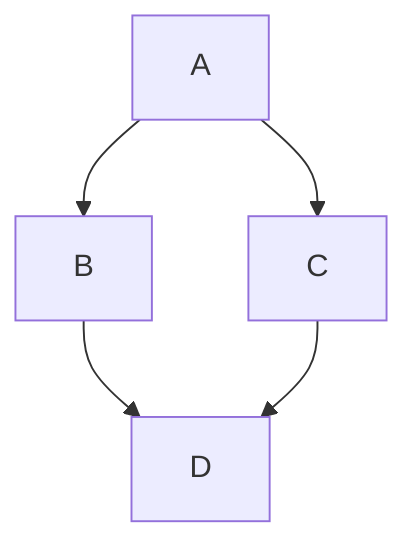

There's a myth of it being easy to get a job as a developer. While there are times where this might be true—especially if you are a senior or staff software engineer working at a well-known tech company—this is not the case for most developers. As soon as you get out on the job market and start directly applying for jobs, the feeling of having it easy quickly disappears.

This book will help you craft a developer resume that represents you fairly, plays to your strengths, and increases your chances of getting to that recruiter call.

### Instructor
Gergely Orosz writes The Pragmatic Engineer Newsletter - the #1 newsletter for engineering managers and senior engineers on Substack. You can find his newsletter here...
