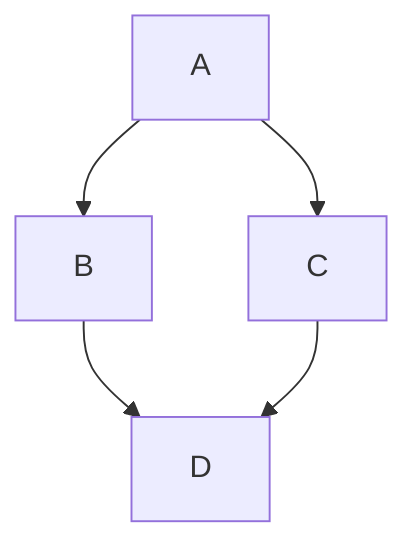

## Contexto & Desafio

Temos aqui um texto muito legal explicando tudo o que foi feito no aiqfome e como eu me desenvolvi como prfissional e como designer e como desenvolvedor e como tudo o que eu aprendi eu apliquei nesse projeto para tentar trazer o melhor resultado possível para a empresa e para os usuarios

## Decisões Arquitetônicas

Temos aqui um texto muito legal explicando tudo o que foi feito no aiqfome e como eu me desenvolvi como prfissional e como designer e como desenvolvedor e como tudo o que eu aprendi eu apliquei nesse projeto para tentar trazer o melhor resultado possível para a empresa e para os usuarios

## Resultado & Aprendizado

Temos aqui um texto muito legal explicando tudo o que foi feito no aiqfome e como eu me desenvolvi como prfissional e como designer e como desenvolvedor e como tudo o que eu aprendi eu apliquei nesse projeto para tentar trazer o melhor resultado possível para a empresa e para os usuarios

```tsx
// Exemplo de como o Shiki fará o highlight deste código na build final
export function connectFigmaToCode(figmaNodeId: string) {
  console.log(`Buscando propriedades do nó: ${figmaNodeId}`);
  return true;
}
```



## Resultado & Aprendizado

O projeto demonstrou que a maior parte do "atrito de handoff" é artificial. Quando design e código falam a mesma linguagem (tokens), o ciclo de validação melhora dramaticamente.

Mais importante: a qualidade da experiência final depende menos de tools e mais de alinhamento de intenção.
